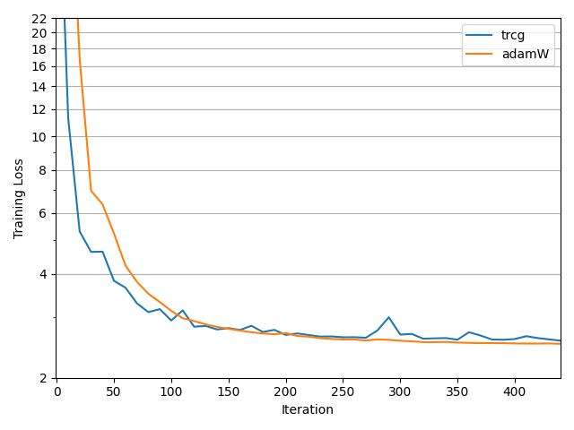
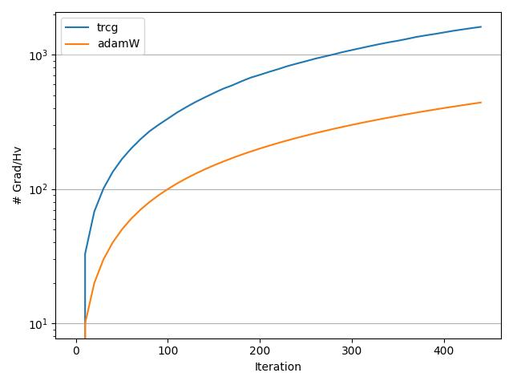

### ✨ Fine-tuning LLMs with `LoRA` and `Hessian-free` optimizers!

### download project
```bash
# create python venv, e.g.,
python -m venv .venv
source .venv/bin/activate
# clone git repository
git clone https://github.com/shizheng-rlfresh/llm-opt.git
# go to directory, and pip install required dependency
pip install -r requirements.txt
```

### Demo Notebooks available

| Optimizer | Notebooks | Optimizer Implementation | Source
|-------------------------------------------|---------------------------------------------------------------------------------------------|----------------------------------------------------|---------------------------------------------------------|
| **Trust Region Newton-CG** | [gpt2-LoRA-TRCG](./examples/gpt2/gpt2-LoRA-TRCG.ipynb) | [optim/trcg.py](./optim/trcg.py) | [[1]](https://www.math.uci.edu/~qnie/Publications/NumericalOptimization.pdf), [[2]](https://proceedings.mlr.press/v95/hsia18a.html), [[3]](https://www.jstor.org/stable/2157277)
| **AdaHessian** | [gpt2-LoRA-AdaHessian](./examples/gpt2/gpt2-LoRA-TRCG.ipynb) | [torch-optimizer](https://github.com/jettify/pytorch-optimizer?tab=readme-ov-file#adahessian) | [AAAI, 2021](https://arxiv.org/abs/2006.00719)
| **OASIS** | 🛠️ | 🛠️ | [ICLR, 2022](https://openreview.net/pdf?id=HCelXXcSEuH)
| **AI-SARAH** | 🛠️ | 🛠️ | [TMLR, 2023](https://openreview.net/pdf?id=WoXJFsJ6Zw)
| **Sophia** | 🛠️ | [SophiaG](https://github.com/Liuhong99/Sophia/blob/main/sophia.py) | [ICLR, 2024](https://openreview.net/pdf?id=3xHDeA8Noi)
| 🤔 what else?
 
### Current status:
- A simple implementation of `Trust Region Newton-CG`, aka, `TRCG`; see [optim/trcg.py](./optim/trcg.py) for details. TRCG is <ins>**Hessian-free** with only Hessian-vector product being needed, and no Hessian!</ins>. As LoRA brings down the size of models, ✨ let's give it a shot! 💪 
    - `Trust Region Newton-CG` is probably <ins>**the most underrated**</ins>  😖 optimizer in machine learning field. It is one of the best optimizers for solving nonconvex problems, e.g., deep neural networks. 
    - Coupled with `preconditioning`, `Trust Region Newton-CG` could yield even more promosing convergence property. 
    - A BIG UNKNOWN - its generalized convergence in `stochastic` setting is yet to be proved ... that means, mini-batch training is not theoretically proved yet in general case.
    - A BIG BUT - I loved it, and I can show many successful uses cases using just naive `TRCG` with DNN, e.g., CNN, GNN, etc. 
    ```python
    # training loop
    for minibatch in train_dataloader:
        # ...
        outputs = model(**minibatch)
        # explicitly define lora param
        lora_param = [w for w in model.parameters() if w.requires_grad]
        # compute gradient explicitily using torch.autograd.grad
        # critical piece is `create_graph=True`
        V = torch.autograd.grad(outputs.loss, lora_param, create_graph=True)
        # ...
        # apply TRCG to take the step
        optimizer.step(minibatch, outputs.loss.item(), V)
        # ...
    ```

- Benchmark results of `TRCG` vs. `AdamW`:
    - T4 GPU | Dataset [oasst2](https://huggingface.co/datasets/sablo/oasst2_curated) |  Model [gpt2](https://huggingface.co/openai-community/gpt2)
    - LoRA config
    ```python
    lora_config = LoraConfig(
    r=4,
    lora_alpha=32, # based on paper - https://arxiv.org/abs/2106.09685
    task_type=TaskType.CAUSAL_LM,
    lora_dropout=0.05
    )
    ```
    - modest level of hyper-parameter search for `AdamW`
    - `TRCG` does not need any hyper-parameter tuning! 💪
    - `# of gradient and/or Hessian vector products` shown in right figure tells `TRCG` is much more expensive than `AdamW`. (<ins>Well, that isn't too bad given `TRCG` is 2nd order method. It doesn't need tuning, right?</ins>)
<div style="display: flex; justify-content: center; margin-bottom: 20px;">
    
    
</div>


### Known Issue:

```python
# this ensures trust region radius won't shrink to zero
optimizer.radius *= 2.0
```
- In pratice, for a stochastic (highly) nonconvex setting, some tricks need to be applied to `TRCG` such as the above line. It ensures `TRCG` perform meaningful steps instead of getting stuck (<ins> a side-effect of being stochastic</ins>). BUT, that is it. Nothing more! 😼

```python
# we first tried maintaining computing graph on 4bit model
config = BitsAndBytesConfig(
    load_in_4bit=True,
    bnb_4bit_quant_type="nf4",
    bnb_4bit_use_double_quant=True,
    bnb_4bit_compute_dtype="float16",
)
model = AutoModelForCausalLM.from_pretrained("openai-community/gpt2",
                                             torch_dtype=torch.float16,
                                             device_map="auto", 
                                             quantization_config=config)
# With the following line, we upcast the model parms to float32 for loRA params
model = prepare_model_for_kbit_training(model, use_gradient_checkpointing=False )
```
- Non-float32 params makes second backward pass unstable, and this is an issue for most optimizers working on fp32 precision.  

<br>
<hr>

### Some thoughts
As we continue to expand the algorithms, we aim to provide easy and simple implementations and running examples on using **adaptive** algorithms, which might be beyond just `Hessian-free` methods.  

For `first-order` methods, we qualify an algorithm as `adaptive` if the tuning efforts of critical hyperparameters are nearly zero, such as **ones with no tuning required on learning rates**.

> e.g., `Adam` is not really a fully-adaptive algorithm ... simply because a global learning rate has to be supplied. It is known that one has to search for good learning-rate + some nice schedulers.

`Second-order` methods, in particular, `Hessian-free` methods, are known to exploit the loss lanscape with assistance of second-order information. With recent development in memory/cost-efficient fine-tuning mechanisms of LLMs, e.g., **LoRA** and **quantization**, it becomes possible to validate  "maybe we can try to use Hessian-free methods to fine-tune some LLMs?" 

|2nd-order optimizers | tuning learning-rate? | (Theory) general stochastic nonconvex setting?
|-------------------------------------------|-------------------------------------|----------------------|
| BFGS | Yes | Yes
| TRCG | No | No |
| Subsample Newton | Yes | Yes |

<br>
<hr>

### Requirement:
```bash
# main packages
pytorch==2.2.2
transformers==4.39.3
bitsandbytes==0.43.0 
peft==0.10.0

# system
os==linux # tested on RHEL, should work for most Linux dist
python>=3.10 
cuda==12.x # 11.8 or above should all work fine
GPU: T4, V100, etc w/ 16GB # at most as old as these guys
```